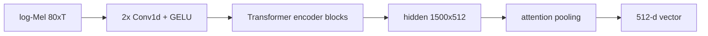
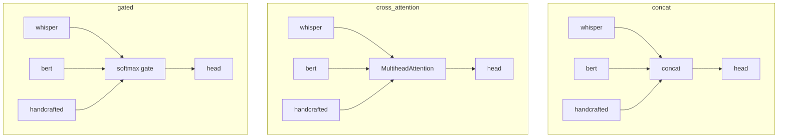

# Architecture diagrams (Sec 7)  [C4]

## 7.1 Overall pipeline
```mermaid
flowchart LR
  A[raw wav<br/>PD 16k / HC 44.1k] --> B[preprocess<br/>mono, 16k, band-limit 7.5k,<br/>LUFS, VAD, fix-len]
  B --> C1[log-Mel 80xT]
  B --> C2[waveform]
  B --> C3[transcript]
  C1 --> D1[Whisper encoder<br/>frozen -> attn-pool 512]
  C2 --> D2[Wav2Vec2<br/>frozen -> pool 768]
  C3 --> D3[BERT<br/>frozen -> CLS 768]
  B --> D4[14 hand-crafted<br/>jitter/shimmer/HNR/MFCC...]
  D1 --> F[Fusion: concat / cross-attn / gated]
  D3 --> F
  D4 --> F
  F --> H[MLP head + sigmoid] --> P[P(PD)]
```

## 7.2 Whisper encoder block


## 7.3 Fusion strategies


## 7.5 Subject-wise CV (leakage-safe)
```mermaid
flowchart LR
  S[22 speakers] --> K{LOSO / StratifiedGroupKFold}
  K --> TR[train speakers]
  K --> TE[test speaker(s)]
  TR --> IV[inner speaker-wise val<br/>early stopping]
  TR -.scaler fit train-only.-> TE
  note[assert train ∩ test speakers = ∅]
```
