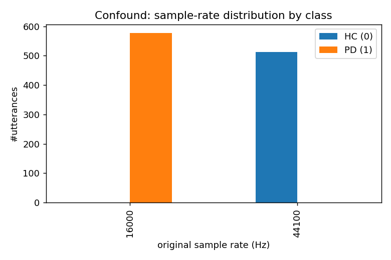
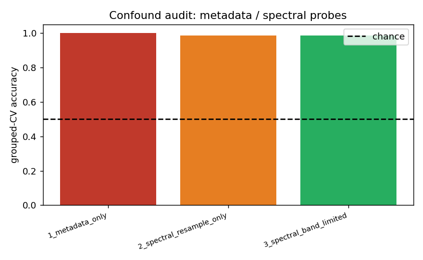
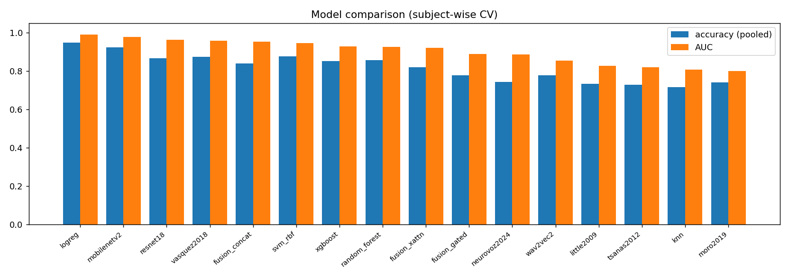
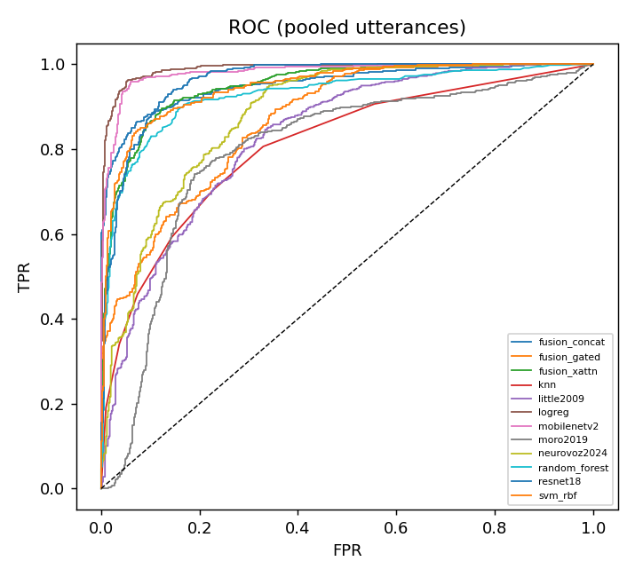
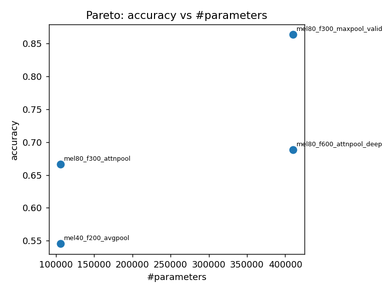
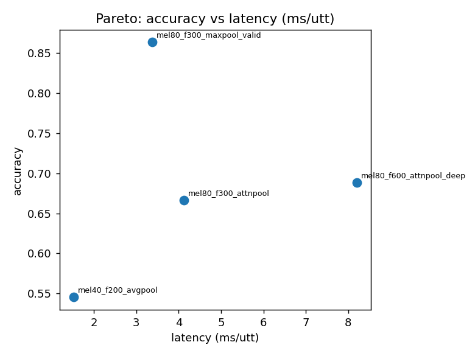
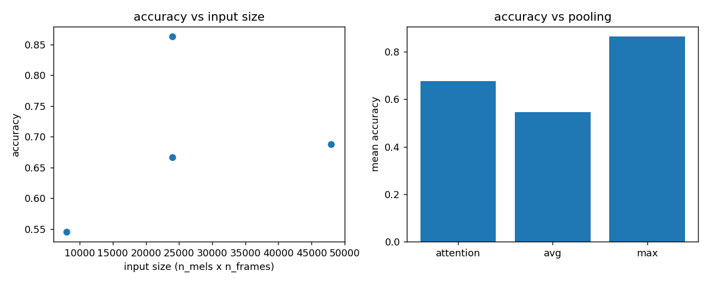

# Results (auto-generated)

> Regenerate: `python run.py report`. Every number traces to a CSV in `artifacts/results/`.

> **Protocol note:** ML, paper, Wav2Vec2 and fusion models are evaluated at the FULL protocol (subject-wise LOSO, 3 seeds). On a CPU-only machine the mel-spectrogram CNNs (resnet18 / mobilenetv2 / neurovoz2024) are run with a reduced but still subject-wise budget (StratifiedGroupKFold k=5, 1 seed) via `run_deep_cpu.py`; regenerate them at full protocol on GPU with `colab/run_full_colab.ipynb`.

## Confound audit (Sec 2, [C5])

| probe | n | accuracy | chance_tol | band_limited_clean |
| --- | --- | --- | --- | --- |
| 1_metadata_only | 1091 | 1.0 | 0.1 | False |
| 2_spectral_resample_only | 1091 | 0.986 | 0.1 | False |
| 3_spectral_band_limited | 1091 | 0.984 | 0.1 | False |

## Model comparison (Sec 4, [C1][C2])

| model | feature_group | accuracy_mean | auc_mean | f1_mean | sensitivity_mean | specificity_mean | subj_accuracy_mean |
| --- | --- | --- | --- | --- | --- | --- | --- |
| svm_rbf | tabular | 0.875 | 0.945 | 0.874 | 0.821 | 0.936 | 1.0 |
| random_forest | tabular | 0.857 | 0.925 | 0.857 | 0.814 | 0.905 | 1.0 |
| xgboost | tabular | 0.852 | 0.929 | 0.852 | 0.804 | 0.906 | 1.0 |
| logreg | tabular | 0.948 | 0.989 | 0.95 | 0.938 | 0.959 | 1.0 |
| knn | tabular | 0.717 | 0.808 | 0.689 | 0.593 | 0.856 | 0.955 |
| little2009 | dysphonia | 0.732 | 0.828 | 0.732 | 0.689 | 0.781 | 0.818 |
| tsanas2012 | dysphonia | 0.729 | 0.819 | 0.725 | 0.675 | 0.789 | 0.985 |
| vasquez2018 | disvoice | 0.874 | 0.957 | 0.874 | 0.824 | 0.931 | 1.0 |
| moro2019 | mfcc_seq | 0.742 | 0.798 | 0.727 | 0.649 | 0.845 | 0.955 |
| wav2vec2 | wav2vec2_emb | 0.777 | 0.854 | 0.775 | 0.734 | 0.826 | 0.955 |
| fusion_concat | multi | 0.839 | 0.953 | 0.826 | 0.733 | 0.959 | 0.955 |
| fusion_xattn | multi | 0.821 | 0.92 | 0.815 | 0.746 | 0.904 | 0.939 |
| fusion_gated | multi | 0.776 | 0.889 | 0.771 | 0.713 | 0.847 | 0.939 |
| resnet18 | resnet18_emb | 0.865 | 0.962 | 0.861 | 0.791 | 0.949 | 1.0 |
| mobilenetv2 | mobilenetv2_emb | 0.924 | 0.977 | 0.925 | 0.892 | 0.96 | 0.97 |
| neurovoz2024 | melspec | 0.742 | 0.886 | 0.707 | 0.615 | 0.886 | 0.864 |

## Statistical tests (Sec 6, [C1])

**McNemar (Holm-corrected), pooled utterances:**

| model_a | model_b | b | c | p_value | p_holm | significant_holm |
| --- | --- | --- | --- | --- | --- | --- |
| fusion_concat | fusion_gated | 192 | 50 | 0.0 | 0.0 | True |
| fusion_concat | fusion_xattn | 86 | 58 | 0.024 | 0.709 | False |
| fusion_concat | knn | 241 | 63 | 0.0 | 0.0 | True |
| fusion_concat | little2009 | 246 | 87 | 0.0 | 0.0 | True |
| fusion_concat | logreg | 37 | 111 | 0.0 | 0.0 | True |
| fusion_concat | mobilenetv2 | 47 | 119 | 0.0 | 0.0 | True |
| fusion_concat | moro2019 | 234 | 76 | 0.0 | 0.0 | True |
| fusion_concat | neurovoz2024 | 195 | 87 | 0.0 | 0.0 | True |
| fusion_concat | random_forest | 116 | 90 | 0.082 | 1.0 | False |
| fusion_concat | resnet18 | 118 | 101 | 0.28 | 1.0 | False |
| fusion_concat | svm_rbf | 98 | 95 | 0.886 | 1.0 | False |
| fusion_concat | tsanas2012 | 256 | 92 | 0.0 | 0.0 | True |
| fusion_concat | vasquez2018 | 80 | 94 | 0.324 | 1.0 | False |
| fusion_concat | wav2vec2 | 144 | 81 | 0.0 | 0.002 | True |
| fusion_concat | xgboost | 122 | 91 | 0.04 | 1.0 | False |
| fusion_gated | fusion_xattn | 49 | 163 | 0.0 | 0.0 | True |
| fusion_gated | knn | 180 | 144 | 0.052 | 1.0 | False |
| fusion_gated | little2009 | 195 | 178 | 0.407 | 1.0 | False |
| fusion_gated | logreg | 33 | 249 | 0.0 | 0.0 | True |
| fusion_gated | mobilenetv2 | 35 | 249 | 0.0 | 0.0 | True |
| fusion_gated | moro2019 | 173 | 157 | 0.409 | 1.0 | False |
| fusion_gated | neurovoz2024 | 143 | 177 | 0.065 | 1.0 | False |
| fusion_gated | random_forest | 85 | 201 | 0.0 | 0.0 | True |
| fusion_gated | resnet18 | 72 | 197 | 0.0 | 0.0 | True |
| fusion_gated | svm_rbf | 73 | 212 | 0.0 | 0.0 | True |
| fusion_gated | tsanas2012 | 206 | 184 | 0.288 | 1.0 | False |
| fusion_gated | vasquez2018 | 60 | 216 | 0.0 | 0.0 | True |
| fusion_gated | wav2vec2 | 108 | 187 | 0.0 | 0.0 | True |
| fusion_gated | xgboost | 94 | 205 | 0.0 | 0.0 | True |
| fusion_xattn | knn | 215 | 65 | 0.0 | 0.0 | True |
| fusion_xattn | little2009 | 233 | 102 | 0.0 | 0.0 | True |
| fusion_xattn | logreg | 31 | 133 | 0.0 | 0.0 | True |
| fusion_xattn | mobilenetv2 | 44 | 144 | 0.0 | 0.0 | True |
| fusion_xattn | moro2019 | 199 | 69 | 0.0 | 0.0 | True |
| fusion_xattn | neurovoz2024 | 181 | 101 | 0.0 | 0.0 | True |
| fusion_xattn | random_forest | 93 | 95 | 0.942 | 1.0 | False |
| fusion_xattn | resnet18 | 94 | 105 | 0.478 | 1.0 | False |
| fusion_xattn | svm_rbf | 76 | 101 | 0.071 | 1.0 | False |
| fusion_xattn | tsanas2012 | 240 | 104 | 0.0 | 0.0 | True |
| fusion_xattn | vasquez2018 | 75 | 117 | 0.003 | 0.12 | False |
| fusion_xattn | wav2vec2 | 132 | 97 | 0.025 | 0.709 | False |
| fusion_xattn | xgboost | 102 | 99 | 0.888 | 1.0 | False |
| knn | little2009 | 163 | 182 | 0.333 | 1.0 | False |
| knn | logreg | 14 | 266 | 0.0 | 0.0 | True |
| knn | mobilenetv2 | 38 | 288 | 0.0 | 0.0 | True |
| knn | moro2019 | 120 | 140 | 0.239 | 1.0 | False |
| knn | neurovoz2024 | 133 | 203 | 0.0 | 0.007 | True |
| knn | random_forest | 21 | 173 | 0.0 | 0.0 | True |
| knn | resnet18 | 48 | 209 | 0.0 | 0.0 | True |
| knn | svm_rbf | 18 | 193 | 0.0 | 0.0 | True |
| knn | tsanas2012 | 168 | 182 | 0.487 | 1.0 | False |
| knn | vasquez2018 | 30 | 222 | 0.0 | 0.0 | True |
| knn | wav2vec2 | 101 | 216 | 0.0 | 0.0 | True |
| knn | xgboost | 31 | 178 | 0.0 | 0.0 | True |
| little2009 | logreg | 31 | 264 | 0.0 | 0.0 | True |
| little2009 | mobilenetv2 | 35 | 266 | 0.0 | 0.0 | True |
| little2009 | moro2019 | 180 | 181 | 1.0 | 1.0 | False |
| little2009 | neurovoz2024 | 154 | 205 | 0.008 | 0.291 | False |
| little2009 | random_forest | 106 | 239 | 0.0 | 0.0 | True |
| little2009 | resnet18 | 87 | 229 | 0.0 | 0.0 | True |
| little2009 | svm_rbf | 75 | 231 | 0.0 | 0.0 | True |
| little2009 | tsanas2012 | 64 | 59 | 0.718 | 1.0 | False |
| little2009 | vasquez2018 | 46 | 219 | 0.0 | 0.0 | True |
| little2009 | wav2vec2 | 129 | 225 | 0.0 | 0.0 | True |
| little2009 | xgboost | 103 | 231 | 0.0 | 0.0 | True |
| logreg | mobilenetv2 | 48 | 46 | 0.918 | 1.0 | False |
| logreg | moro2019 | 250 | 18 | 0.0 | 0.0 | True |
| logreg | neurovoz2024 | 215 | 33 | 0.0 | 0.0 | True |
| logreg | random_forest | 117 | 17 | 0.0 | 0.0 | True |
| logreg | resnet18 | 123 | 32 | 0.0 | 0.0 | True |
| logreg | svm_rbf | 85 | 8 | 0.0 | 0.0 | True |
| logreg | tsanas2012 | 269 | 31 | 0.0 | 0.0 | True |
| logreg | vasquez2018 | 76 | 16 | 0.0 | 0.0 | True |
| logreg | wav2vec2 | 171 | 34 | 0.0 | 0.0 | True |
| logreg | xgboost | 119 | 14 | 0.0 | 0.0 | True |
| mobilenetv2 | moro2019 | 259 | 29 | 0.0 | 0.0 | True |
| mobilenetv2 | neurovoz2024 | 213 | 33 | 0.0 | 0.0 | True |
| mobilenetv2 | random_forest | 137 | 39 | 0.0 | 0.0 | True |
| mobilenetv2 | resnet18 | 120 | 31 | 0.0 | 0.0 | True |
| mobilenetv2 | svm_rbf | 121 | 46 | 0.0 | 0.0 | True |
| mobilenetv2 | tsanas2012 | 264 | 28 | 0.0 | 0.0 | True |
| mobilenetv2 | vasquez2018 | 101 | 43 | 0.0 | 0.0 | True |
| mobilenetv2 | wav2vec2 | 173 | 38 | 0.0 | 0.0 | True |
| mobilenetv2 | xgboost | 144 | 41 | 0.0 | 0.0 | True |
| moro2019 | neurovoz2024 | 152 | 202 | 0.009 | 0.313 | False |
| moro2019 | random_forest | 54 | 186 | 0.0 | 0.0 | True |
| moro2019 | resnet18 | 41 | 182 | 0.0 | 0.0 | True |
| moro2019 | svm_rbf | 43 | 198 | 0.0 | 0.0 | True |
| moro2019 | tsanas2012 | 194 | 188 | 0.798 | 1.0 | False |
| moro2019 | vasquez2018 | 44 | 216 | 0.0 | 0.0 | True |
| moro2019 | wav2vec2 | 120 | 215 | 0.0 | 0.0 | True |
| moro2019 | xgboost | 53 | 180 | 0.0 | 0.0 | True |
| neurovoz2024 | random_forest | 94 | 176 | 0.0 | 0.0 | True |
| neurovoz2024 | resnet18 | 75 | 166 | 0.0 | 0.0 | True |
| neurovoz2024 | svm_rbf | 81 | 186 | 0.0 | 0.0 | True |
| neurovoz2024 | tsanas2012 | 209 | 153 | 0.004 | 0.142 | False |
| neurovoz2024 | vasquez2018 | 74 | 196 | 0.0 | 0.0 | True |
| neurovoz2024 | wav2vec2 | 121 | 166 | 0.009 | 0.313 | False |
| neurovoz2024 | xgboost | 104 | 181 | 0.0 | 0.0 | True |
| random_forest | resnet18 | 73 | 82 | 0.52 | 1.0 | False |
| random_forest | svm_rbf | 34 | 57 | 0.021 | 0.633 | False |
| random_forest | tsanas2012 | 235 | 97 | 0.0 | 0.0 | True |
| random_forest | vasquez2018 | 44 | 84 | 0.001 | 0.023 | True |
| random_forest | wav2vec2 | 131 | 94 | 0.016 | 0.525 | False |
| random_forest | xgboost | 39 | 34 | 0.64 | 1.0 | False |
| resnet18 | svm_rbf | 73 | 87 | 0.304 | 1.0 | False |
| resnet18 | tsanas2012 | 232 | 85 | 0.0 | 0.0 | True |
| resnet18 | vasquez2018 | 67 | 98 | 0.02 | 0.605 | False |
| resnet18 | wav2vec2 | 141 | 95 | 0.003 | 0.129 | False |
| resnet18 | xgboost | 88 | 74 | 0.307 | 1.0 | False |
| svm_rbf | tsanas2012 | 238 | 77 | 0.0 | 0.0 | True |
| svm_rbf | vasquez2018 | 45 | 62 | 0.122 | 1.0 | False |
| svm_rbf | wav2vec2 | 148 | 88 | 0.0 | 0.005 | True |
| svm_rbf | xgboost | 60 | 32 | 0.005 | 0.176 | False |
| tsanas2012 | vasquez2018 | 48 | 226 | 0.0 | 0.0 | True |
| tsanas2012 | wav2vec2 | 134 | 235 | 0.0 | 0.0 | True |
| tsanas2012 | xgboost | 94 | 227 | 0.0 | 0.0 | True |
| vasquez2018 | wav2vec2 | 151 | 74 | 0.0 | 0.0 | True |
| vasquez2018 | xgboost | 84 | 39 | 0.0 | 0.003 | True |
| wav2vec2 | xgboost | 108 | 140 | 0.049 | 1.0 | False |

> Caveat: Utterances from the same speaker are not independent; McNemar is anti-conservative here (Sec 6.2).

**Friedman omnibus:** {
"statistic": 42.96295143212949,
"p_value": 0.0013115021811019552,
"n_folds": 5,
"n_models": 20,
"avg_ranks": {
"fusion_concat": 18.2,
"fusion_gated": 11.2,
"fusion_xattn": 10.1,
"knn": 13.5,
"little2009": 14.7,
"logreg": 6.9,
"mobilenetv2": 4.4,
"moro2019": 12.8,
"neurovoz2024": 10.1,
"random_forest": 7.0,
"resnet18": 7.4,
"svm_rbf": 5.5,
"sweep_mel40_f200_avgpool": 17.5,
"sweep_mel80_f300_attnp

## Feature/architecture sweep (Sec 8)

| variant | cache_key | n_mels | n_frames | pooling | padding | accuracy | auc | params | latency_ms | out_feature_dim | train_time_s |
| --- | --- | --- | --- | --- | --- | --- | --- | --- | --- | --- | --- |
| mel40_f200_avgpool | 3fa892ed08d5 | 40 | 200 | avg | same | 0.545 | 0.644 | 105953 | 1.518 | 128 | 14.03 |
| mel80_f300_attnpool | e261899b0890 | 80 | 300 | attention | same | 0.667 | 0.841 | 106082 | 4.118 | 128 | 42.1 |
| mel80_f300_maxpool_valid | e261899b0890 | 80 | 300 | max | valid | 0.864 | 0.951 | 409825 | 3.373 | 256 | 45.15 |
| mel80_f600_attnpool_deep | 08d794acabf5 | 80 | 600 | attention | same | 0.688 | 0.943 | 410082 | 8.204 | 256 | 763.14 |

